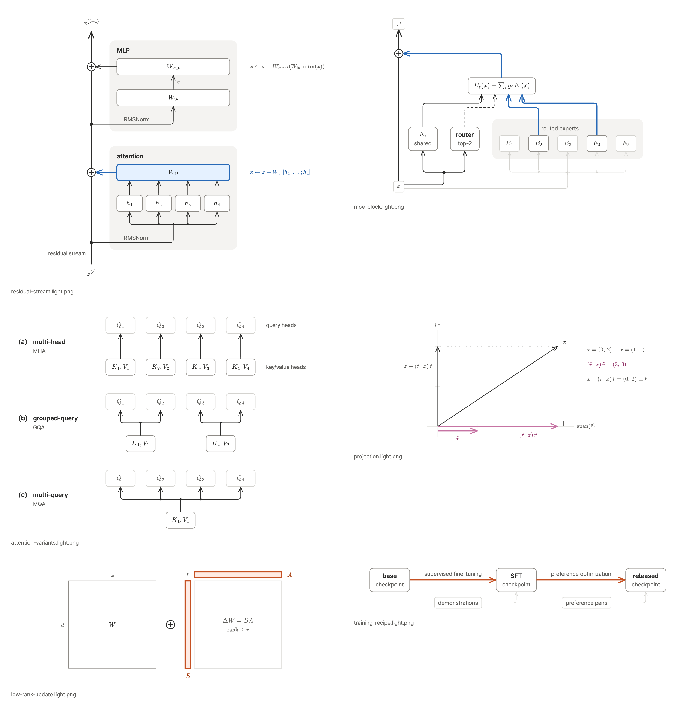

# gigio-figures

Portable figure skills for coding agents. One skill plans and draws the figures of technical documents on one visual grammar; two others cover the native draw.io format and a deliberately simple register on request. All three share one design system.

| Skill | Use it for | Default artifact |
| --- | --- | --- |
| [`technical-figure`](skills/technical-figure/SKILL.md) | Figures for technical documents, posts, and papers: mechanism and architecture diagrams, pipelines, vector geometry, grids and tensor shapes, method comparisons, and charts of measured data; plans a document's figure set first | semantic SVG → light and dark PNG, portable SVG, lint report |
| [`drawio-diagram`](skills/drawio-diagram/SKILL.md) | Explicit native `.drawio` requests and existing draw.io edits | editable mxGraph XML |
| [`eli5-figure`](skills/eli5-figure/SKILL.md) | A deliberately simple one-analogy figure for readers outside the field, on explicit request only | same pipeline as `technical-figure` |

Routing is by artifact and register:

- A figure delivered as an image in a document, post, or paper uses `technical-figure`, whatever its form.
- Native draw.io format or draw.io-specific metadata uses `drawio-diagram`.
- An explicit request for a simple, non-expert figure ("ELI5", "쉽게") uses `eli5-figure`, which reduces the exact figure and records what it merged and hid.

The default reader is a peer in the domain who lacks only the project's context: exact names first, mechanism on the edges, and the full structure the question needs. The canvas holds names and mechanism; counts, timestamps, and hedges go to the caption. Simplification is never the default; it is the user's explicit choice.

## Install

Install through the Skills CLI. The `--agent` value selects the target harness; manual paths and restart behavior are documented for [Claude Code](.claude/INSTALL.md), [Codex](.codex/INSTALL.md), [Cursor](.cursor/INSTALL.md), and [Gemini CLI](.gemini/INSTALL.md).

```bash
npx skills add gigio1023/gigio-figures@technical-figure --agent claude-code
npx skills add gigio1023/gigio-figures@drawio-diagram --agent claude-code
npx skills add gigio1023/gigio-figures@eli5-figure --agent claude-code
```

Swap `--agent` for `codex`, `cursor`, or `gemini-cli`. Each skill is standalone; install only the ones you need.

`technical-figure` and `eli5-figure` need Node.js 20 or newer and a Chromium-family browser (Google Chrome, Chromium, Edge, or a Playwright browser build). Run `bash scripts/setup.sh` once from the installed skill directory; it installs pinned npm packages and OFL fonts into `~/.cache/technical-figure` (override with `TECHNICAL_FIGURE_CACHE`) and is the only step that uses the network. It never installs a browser. Charts additionally need `uv`.

## Usage

Ask naturally. Explicit skill invocation is optional when the request clearly names the artifact or content.

```text
Redo the figures in this design doc so they share one visual language.
Draw how attention and the MLP read from and write to the residual stream.
Compare MHA, GQA, and MQA on one figure.
Plot these benchmark scores with our model as the focal series.
Create an editable .drawio version of this service map.
```

## technical-figure



The examples in `skills/technical-figure/assets/examples/` were drawn by following the skill, with their figure plan, specs, and sources.

The skill works in three layers.

1. **Plan.** For a document or a set of figures, it writes a figure plan: the claims that need a picture, a figure budget, a semantic map that gives each of three hues and each line style one meaning for the whole document, and a storyboard. Each figure then gets a FigureSpec: the reader's question, a one-sentence claim that becomes the caption's first sentence, the exact nodes and relations, one focal element, and what goes to the caption instead of the canvas.
2. **Draw.** The form comes from the claim's shape (spine, zoom, sibling variants, delta highlight, lineage, grid, geometry, chart), and the grammar sets the emphasis budget, line styles, and comparison rules. Sources are semantic SVG with classes only; box-and-arrow figures can be laid out with elkjs, geometry and grids are computed, and charts use matplotlib with the same tokens.
3. **Check.** `scripts/render.mjs` applies the theme, typesets TeX math as glyph paths, draws arrowheads, renders light and dark PNGs at 2x with the real fonts, writes a portable SVG, and runs `scripts/lint.mjs`, which measures real bounding boxes for overlaps, overflow, minimum type size, contrast, arrow collisions, Unicode math, and height. Review then checks the render against the spec item by item and, for a document, on a contact sheet.

From `skills/technical-figure/`:

```bash
bash scripts/setup.sh --check
node scripts/render.mjs assets/examples/residual-stream.svg
node scripts/layout.mjs assets/examples/moe-block.json -o /tmp/moe-block.svg
node scripts/measure.mjs --class t "residual stream"
node scripts/sheet.mjs assets/examples/*.light.png --columns 2 --width 704 --theme light -o /tmp/sheet.png
node scripts/test/run.mjs
uv run --with matplotlib python scripts/example_chart.py
```

## eli5-figure

The simple register. It starts from the exact `technical-figure` figure or an equivalent inventory, chooses one everyday analogy, keeps at most five concepts and one branch, and writes a reduction record (kept, merged, hidden, where the analogy breaks) that goes into the prose beside the figure, never into the figure. It renders on the same pipeline and passes the same lint. It activates only on an explicit request such as "ELI5" or "쉽게 그려줘"; for domain readers the simple figure is redundancy.

## drawio-diagram

This route is intentionally native-format specific. It prefers bare, uncompressed `mxGraphModel` XML and explicit automatic layout for new files. Manual terminal pins and waypoints are a fallback for routes that remain ambiguous after layout. Its style recipes translate the shared tokens into draw.io style strings.

From `skills/drawio-diagram/`:

```bash
python3 scripts/apply_auto_layout.py input.drawio laid-out.drawio horizontalFlow
python3 scripts/validate_drawio_xml.py path/to/file.drawio
python3 scripts/validate_drawio_layout.py path/to/file.drawio
python3 -m unittest discover -s scripts -p 'test_*.py'
```

The committed upstream `jgraph/drawio-mcp` digests provide offline factual lookup. Local workflow guidance wins when an older vendored agent instruction conflicts with the current skill.

## Shared figure style

`shared/figure-style/` is the repository source of truth:

- [`tokens.json`](shared/figure-style/tokens.json) stores font stacks, type sizes, light and dark palettes, strokes, arrowheads, radii, spacing, and limits.
- [`principles.md`](shared/figure-style/principles.md) stores the backend-neutral content and visual rules.
- [`provenance.md`](shared/figure-style/provenance.md) records the evidence behind the system.
- `adapters/drawio-style.md` translates the tokens to draw.io style strings.

Each skill vendors the subset it needs so individual installation stays self-contained; `eli5-figure` also vendors the `technical-figure` render pipeline. Synchronize and verify those copies with:

```bash
python3 scripts/sync_figure_style.py
python3 scripts/sync_figure_style.py --check
```

## Repository layout

- `shared/figure-style/`: canonical tokens, principles, provenance, and the draw.io adapter
- `skills/technical-figure/`: planning, form catalog, grammar, routes, review, render and lint pipeline, chart module, examples
- `skills/drawio-diagram/`: native XML guidance, references, assets, validators
- `skills/eli5-figure/`: simple-register contract and principles, vendored pipeline
- `scripts/sync_figure_style.py`: standalone-skill snapshot synchronization
- `.claude/`, `.codex/`, `.cursor/`, `.gemini/`: harness installation guides

## Markdown authoring

Keep each natural-language Markdown paragraph on one source line, including prose within list items and Markdown templates. Do not manually wrap prose to 80, 100, or any other column width; use editor soft wrapping for readability. Preserve paragraph boundaries, list structure, tables, fenced code, HTML, intentional hard breaks, frontmatter semantics, and literal examples. This convention does not change code or docstring line-length constraints.

The upstream vendoring script copies source bytes. After refreshing `skills/drawio-diagram/references/fetched/`, apply this paragraph convention to its Markdown prose and update `NOTICE` to identify any locally adjusted files. Preserve upstream revision and fetch metadata.

## Attribution

This repository vendors upstream files from `jgraph/drawio-mcp` under Apache-2.0 and layers local guidance on top. Exact mappings and the vendored revision are recorded in [`NOTICE`](NOTICE). The bundled pipeline downloads Pretendard and JetBrains Mono under the SIL Open Font License 1.1 at setup time.
